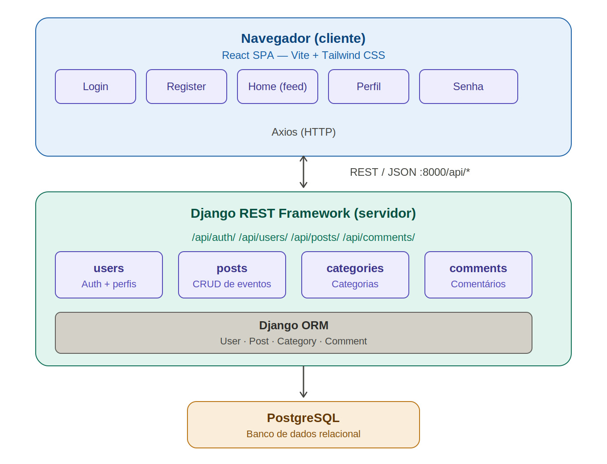
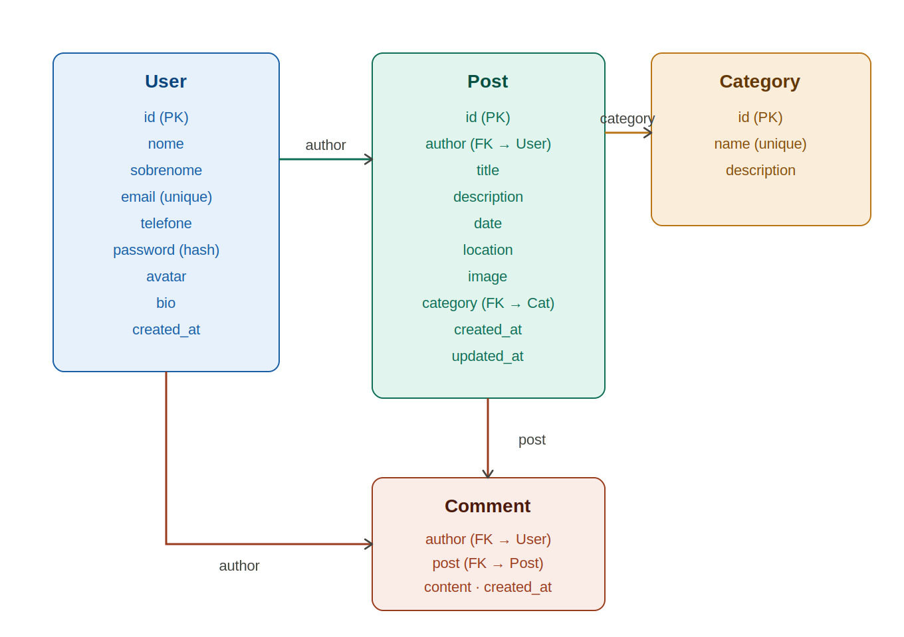
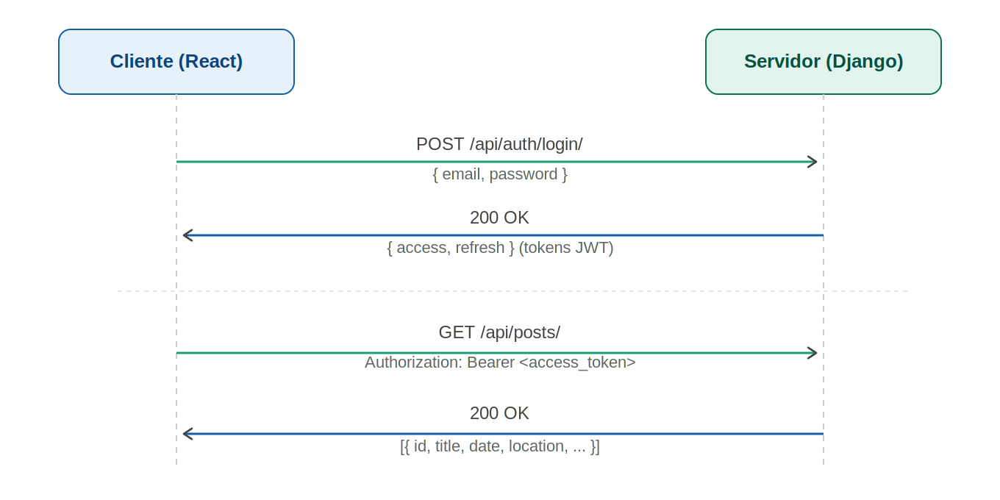
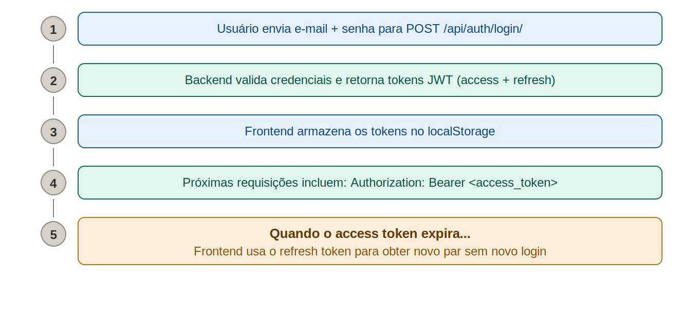
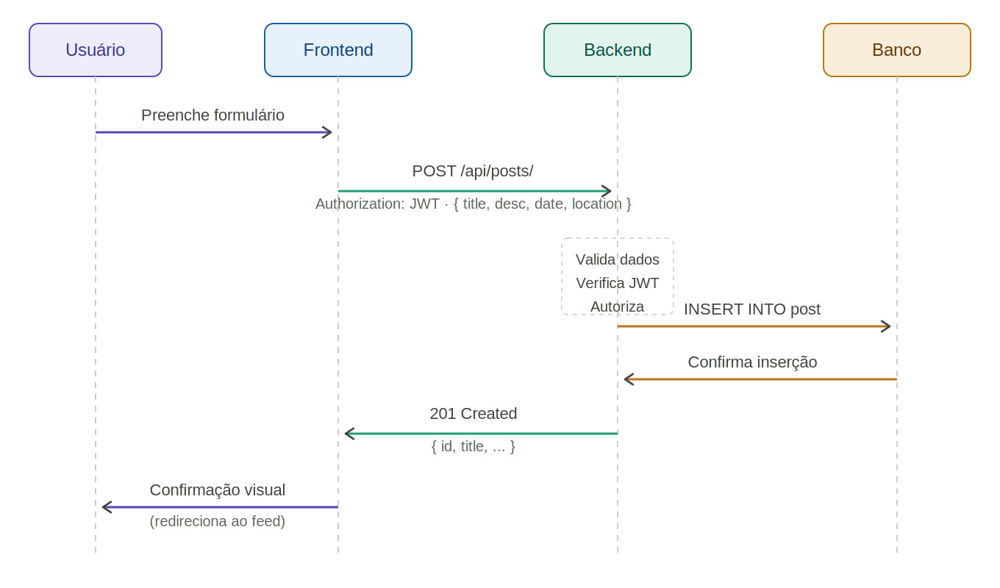
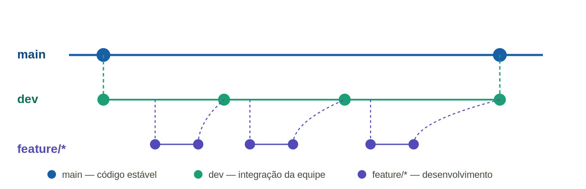

# Arquitetura do Sistema — Festa de Ouro

## 1. Visão Geral

**Festa de Our/home/fabricio/Descargaso** é uma plataforma web comunitária para publicação e descoberta de eventos locais (festas, shows, esportes, churrascos, etc.). Adota uma arquitetura de **Single Page Application (SPA)** com **API REST** no backend, containerizada com Docker.

O sistema permite que usuários se cadastrem, publiquem eventos e interajam com publicações de outros membros da comunidade.

---

## 2. Arquitetura de Alto Nível



O diagrama acima ilustra a arquitetura de três camadas da plataforma: o **Navegador (cliente)** executa a React SPA construída com Vite e Tailwind CSS, expondo as páginas Login, Register, Home (feed), Perfil e Senha. A comunicação com o servidor ocorre via **Axios (HTTP)** sobre REST/JSON na porta `:8000/api/*`. O **Django REST Framework (servidor)** organiza os recursos em quatro apps — `users`, `posts`, `categories` e `comments` —, todos acessados pelo Django ORM. A camada de persistência é um banco **PostgreSQL** (ou SQLite em desenvolvimento).

**Fluxo resumido:**

1. O usuário acessa a SPA React servida pelo Vite na porta 3000.
2. Requisições para `/api/*` são proxyzadas pelo Vite para o backend Django na porta 8000.
3. O Django REST Framework processa a requisição, aplica autenticação JWT e realiza operações no banco via ORM.
4. A resposta JSON retorna ao frontend, que atualiza a interface.

---

## 3. Modelo de Dados



O modelo de dados é composto por quatro entidades principais:

| Entidade     | Descrição                                                                                                                                                              |
| ------------ | ---------------------------------------------------------------------------------------------------------------------------------------------------------------------- |
| **User**     | Usuário do sistema — autenticação por e-mail. Campos: `id`, `nome`, `sobrenome`, `email (unique)`, `telefone`, `password (hash)`, `avatar`, `bio`, `created_at`.       |
| **Post**     | Publicação de evento. Campos: `id`, `author (FK → User)`, `title`, `description`, `date`, `location`, `image`, `category (FK → Category)`, `created_at`, `updated_at`. |
| **Category** | Categoria do evento. Campos: `id`, `name (unique)`, `description`.                                                                                                     |
| **Comment**  | Comentário em um post. Campos: `author (FK → User)`, `post (FK → Post)`, `content`, `created_at`.                                                                      |

**Relacionamentos:**

- `User` (1) → (N) `Post`: um usuário pode criar múltiplas publicações.
- `Post` (N) → (1) `Category`: cada post pertence a uma categoria.
- `User` (1) → (N) `Comment` e `Post` (1) → (N) `Comment`: comentários referenciam tanto o autor quanto o post.

---

## 4. Fluxo REST — Comunicação Cliente-Servidor



O diagrama de sequência acima mostra a comunicação padrão entre **Cliente (React)** e **Servidor (Django)**:

1. O cliente envia `POST /api/auth/login/` com `{ email, password }`.
2. O servidor responde `200 OK` com `{ access, refresh }` (tokens JWT).
3. Nas requisições subsequentes, o cliente inclui `Authorization: Bearer <access_token>`.
4. O servidor retorna `200 OK` com os dados solicitados (ex.: lista de posts).

---

## 5. Autenticação JWT



O fluxo de autenticação segue cinco etapas:

| #   | Etapa                        | Descrição                                                                                                        |
| --- | ---------------------------- | ---------------------------------------------------------------------------------------------------------------- |
| 1   | **Login**                    | Usuário envia e-mail + senha para `POST /api/auth/login/`.                                                       |
| 2   | **Validação**                | Backend valida as credenciais e retorna tokens JWT (`access` + `refresh`).                                       |
| 3   | **Armazenamento**            | Frontend armazena os tokens no `localStorage`.                                                                   |
| 4   | **Requisições autenticadas** | Próximas requisições incluem `Authorization: Bearer <access_token>`.                                             |
| 5   | **Refresh automático**       | Quando o `access_token` expira, o frontend usa o `refresh_token` para obter um novo par — sem exigir novo login. |

O interceptor de response do Axios captura erros `401`, executa o refresh e reenfileira as requisições que falharam durante o processo.

---

## 6. Fluxo de Criação de Evento



O diagrama detalha o ciclo completo de publicação de um evento:

1. **Usuário** preenche o formulário no frontend.
2. **Frontend** envia `POST /api/posts/` com `Authorization: JWT` e o payload `{ title, desc, date, location }`.
3. **Backend** valida os dados, verifica o JWT e autoriza a operação.
4. **Backend** executa `INSERT INTO post` no banco de dados.
5. **Banco** confirma a inserção.
6. **Backend** retorna `201 Created` com `{ id, title, ... }`.
7. **Frontend** exibe confirmação visual e redireciona ao feed.

> **Nota:** atualmente o backend expõe apenas leitura de posts (`ReadOnlyModelViewSet`). O fluxo acima representa a implementação planejada para o CRUD completo.

---

## 7. Componentes do Backend

### 7.1 `core` — Configurações do Projeto

| Arquivo               | Função                                                                                                                |
| --------------------- | --------------------------------------------------------------------------------------------------------------------- |
| `settings.py`         | Configurações gerais: `AUTH_USER_MODEL`, apps instalados, middleware CORS, autenticação JWT, banco SQLite/PostgreSQL. |
| `urls.py`             | Rotas da API via `DefaultRouter` + rotas manuais para JWT.                                                            |
| `wsgi.py` / `asgi.py` | Entry points para servidores WSGI/ASGI.                                                                               |

### 7.2 `apps.users` — Gerenciamento de Usuários

| Componente                  | Arquivo          | Descrição                                                   |
| --------------------------- | ---------------- | ----------------------------------------------------------- |
| `UserManager`               | `models.py`      | Manager customizado com `create_user` e `create_superuser`. |
| `User`                      | `models.py`      | Modelo de usuário com autenticação por e-mail.              |
| `UserInfo`                  | `models.py`      | Perfil complementar (nome, idade, república).               |
| `UserSerializer`            | `serializers.py` | Serializer para criação/consulta. Password `write_only`.    |
| `UserViewSet`               | `views.py`       | CRUD completo de usuários (`ModelViewSet`).                 |
| `CustomTokenObtainPairView` | `views.py`       | View para obtenção de token JWT via e-mail.                 |
| `CustomTokenRefreshView`    | `views.py`       | View para renovação de token JWT.                           |

### 7.3 `apps.posts` — Publicações de Eventos

| Componente       | Arquivo          | Descrição                                                              |
| ---------------- | ---------------- | ---------------------------------------------------------------------- |
| `Post`           | `models.py`      | Modelo de publicação: título, data, descrição, foto, categoria, autor. |
| `PostSerializer` | `serializers.py` | Inclui dados do autor aninhados via `UserWithInfoSerializer`.          |
| `PostViewSet`    | `views.py`       | View read-only (`ReadOnlyModelViewSet`).                               |

### 7.4 `apps.categories` e `apps.comments` — Stubs

Registrados em `INSTALLED_APPS` mas sem models, views ou rotas implementadas. São placeholders para funcionalidades futuras.

### 7.5 Endpoints da API

| Método               | Endpoint                | Descrição                              |
| -------------------- | ----------------------- | -------------------------------------- |
| POST                 | `/api/token/`           | Obter par access/refresh JWT           |
| POST                 | `/api/token/refresh/`   | Renovar access token                   |
| GET/POST             | `/api/users/`           | Listar / Criar usuário                 |
| GET/PUT/PATCH/DELETE | `/api/users/{id}/`      | Detalhar / Atualizar / Remover usuário |
| GET/POST             | `/api/users-info/`      | Listar / Criar perfil                  |
| GET/PUT/PATCH/DELETE | `/api/users-info/{id}/` | Detalhar / Atualizar / Remover perfil  |
| GET                  | `/api/posts/`           | Listar publicações (com autor)         |
| GET                  | `/api/posts/{id}/`      | Detalhar publicação                    |
| GET                  | `/admin/`               | Admin Django                           |

---

## 8. Componentes do Frontend

### 8.1 Páginas

| Página         | Descrição                                                                                                           |
| -------------- | ------------------------------------------------------------------------------------------------------------------- |
| `Home.jsx`     | Feed principal. Lista todos os posts via `getPosts()` e renderiza `PostCard`. Botão "Criar Evento" (apenas logado). |
| `Login.jsx`    | Formulário email/senha → `POST /api/token/`. Armazena tokens no `localStorage`.                                     |
| `Register.jsx` | Formulário completo → cria `User` + `UserInfo` + auto-login.                                                        |
| `User.jsx`     | Perfil do usuário: capa, avatar, estatísticas, três abas e formulário de edição.                                    |
| `Senha.jsx`    | Formulário de recuperação de senha (apenas UI — sem endpoint).                                                      |

### 8.2 Componentes

| Componente     | Descrição                                                                                                                                    |
| -------------- | -------------------------------------------------------------------------------------------------------------------------------------------- |
| `PostCard.jsx` | Card de evento: avatar, nome, república, timestamp, conteúdo, imagem, badge de categoria. Botões de like (local), comentário e compartilhar. |

### 8.3 `services/api.js` — Cliente HTTP

Cliente Axios configurado com:

- `baseURL: '/api'`
- **Interceptor de request**: anexa `Authorization: Bearer <token>` do `localStorage`.
- **Interceptor de response**: em `401`, tenta renovar o token; se falhar, limpa o `localStorage` e redireciona para `/login`. Usa fila (`failedQueue`) para requisições concorrentes durante o refresh.

Funções exportadas: `getUsers()`, `getUser(id)`, `getUserInfo(id)`, `getAllUsersInfo()`, `getPosts()`, `getPost(id)`, `updateUserInfo(id, data)`, `isAuthenticated()`, `logout()`.

---

## 9. Git Flow



O projeto adota um fluxo de três branches:

| Branch      | Cor   | Papel                                             |
| ----------- | ----- | ------------------------------------------------- |
| `main`      | Azul  | Código estável — merges apenas a partir de `dev`. |
| `dev`       | Verde | Integração da equipe — base para novas features.  |
| `feature/*` | Roxo  | Desenvolvimento de funcionalidades isoladas.      |

**Ciclo:** `feature/*` é criada a partir de `dev` → desenvolvida → mergeada de volta em `dev` → ao atingir estabilidade, `dev` é mergeada em `main`.

---

## 10. Implantação (Docker)

```
Browser :3000
    └─→ Vite Dev Server (frontend container, Node 22-slim)
             └─→ Proxy /api/* → Gunicorn :8000 (backend container, Python 3.12)
                                      └─→ db.sqlite3
```

| Serviço    | Dockerfile   | Porta | Comando                             |
| ---------- | ------------ | ----- | ----------------------------------- |
| `backend`  | Python 3.12  | 8000  | `migrate && runserver 0.0.0.0:8000` |
| `frontend` | Node 22-slim | 3000  | `npm run dev` (Vite)                |

**Proxy Vite (`vite.config.js`):**

```js
proxy: {
  '/api': {
    target: 'http://backend:8000',
    changeOrigin: true,
  },
}
```

---

## 11. Tecnologias Utilizadas

### Backend

| Tecnologia            | Versão | Função           |
| --------------------- | ------ | ---------------- |
| Python                | 3.12   | Linguagem        |
| Django                | 6.0.5  | Framework web    |
| Django REST Framework | 3.17.1 | API REST         |
| SimpleJWT             | 5.5.1  | Autenticação JWT |
| django-cors-headers   | 4.9.0  | CORS             |
| SQLite / PostgreSQL   | —      | Banco de dados   |

### Frontend

| Tecnologia       | Versão  | Função               |
| ---------------- | ------- | -------------------- |
| React            | ^19.2.6 | UI                   |
| React Router DOM | ^7.15.1 | Roteamento SPA       |
| Axios            | ^1.16.1 | Cliente HTTP         |
| Vite             | ^8.0.12 | Bundler / Dev Server |
| Tailwind CSS     | CDN     | Estilização          |

---

## 12. Estrutura de Diretórios

```
Festa-de-Ouro/
├── .env
├── README.md
└── home/
    ├── docker-compose.yml
    ├── backend/
    │   ├── Dockerfile
    │   ├── requirements.txt
    │   ├── manage.py
    │   ├── seed.py
    │   ├── db.sqlite3
    │   ├── core/
    │   │   ├── settings.py
    │   │   ├── urls.py
    │   │   ├── wsgi.py
    │   │   └── asgi.py
    │   └── apps/
    │       ├── users/
    │       ├── posts/
    │       ├── categories/   ← stub
    │       └── comments/     ← stub
    └── frontend/
        ├── Dockerfile
        ├── package.json
        ├── vite.config.js
        ├── index.html
        └── src/
            ├── main.jsx
            ├── App.jsx
            ├── pages/
            │   ├── Home.jsx
            │   ├── Login.jsx
            │   ├── Register.jsx
            │   ├── User.jsx
            │   └── Senha.jsx
            ├── components/
            │   └── PostCard.jsx
            └── services/
                └── api.js
```

---

## 13. Limitações Atuais e Próximos Passos

### Limitações

- **Posts read-only**: o backend expõe apenas leitura (`ReadOnlyModelViewSet`). O botão "Criar Evento" não possui funcionalidade.
- **Categorias e Comentários**: apps registrados sem implementação.
- **Likes**: funcionam apenas no estado local do React, sem persistência.
- **Recuperação de Senha**: apenas UI, sem endpoint no backend.
- **Banco de dados**: SQLite em desenvolvimento; `.env` contém string PostgreSQL comentada para migração futura.

### Próximos Passos

1. Implementar CRUD completo de posts (backend + frontend).
2. Desenvolver os apps `categories` e `comments`.
3. Implementar sistema de likes persistente.
4. Criar endpoint de recuperação de senha.
5. Migrar para PostgreSQL em produção.
6. Exigir JWT para operações de escrita nas views.
